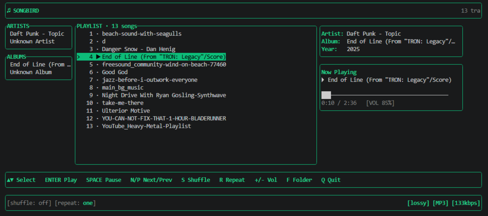

# Songbird

Songbird is a TUI music player built with Rust. It scans the assigned music folder recursively, reads metadata, and plays tracks through `mpv` while keeping the interface fast and readable in a terminal.



## Features

- Full-screen TUI with rounded green panels
- Recursive audio scanning for MP3, FLAC, WAV, OGG, M4A, and AAC files
- Metadata extraction for title, artist, album, year, codec, bitrate, duration, and lossless status
- Concurrent file scanning for faster library builds
- Persistent folder configuration saved to the user home directory
- Playback controls for play, pause, next, previous, repeat, shuffle, and volume
- Auto-advance to the next track when the current track ends
- Folder switching without restarting the app

## Requirements

Before running the project, make sure the following are installed:

- Rust stable toolchain
- `mpv` installed and available on your `PATH`
  - Windows: `mpv.exe`
  - macOS/Linux: `mpv`

## Installation

### From crates.io

```bash
cargo install songbird-tui
```

This installs a binary called `songbird`. Make sure `mpv` is on your `PATH` before running it.

### From source

```bash
git clone https://github.com/kaizoku010/Songbird-TUI.git
cd Songbird-TUI
cargo build --release
```

## Running the app

If you installed from crates.io:

```bash
songbird
```

If you built from source:

```bash
cargo run --release
```

You can also run the built binary directly:

```bash
./target/release/songbird
```

On Windows:

```powershell
.\target\release\songbird.exe
```

## First run

On first launch, the app shows a splash screen asking for a music folder. Enter a directory that contains your audio files, then press `Enter` to confirm.

The selected folder is saved to:

- Windows: `%USERPROFILE%\.songbird\config.json`
- macOS/Linux: `~/.songbird/config.json`

## Controls

### Splash screen

- `Enter`: confirm selected folder
- `Esc`: cancel if a previous folder exists
- Arrow keys: move the cursor through the path
- `Backspace` / `Delete`: edit the folder text
- Mouse paste / terminal paste: paste a folder path into the field

### Library screen

- `Up` / `Down`: move selection through the playlist
- `Enter`: play the selected track
- `Space`: pause or resume playback
- `N` / `P`: next and previous tracks
- `S`: toggle shuffle mode
- `R`: cycle repeat mode: `off -> all -> one`
- `+` / `-`: adjust volume
- `F`: change the music folder
- `Q`: quit the app

## Project structure

```text
src/
  config.rs        - loads and saves the configured music folder
  layout.rs        - layout sizing and UI helpers
  main.rs          - app loop, keyboard handling, rendering, screens
  player.rs        - mpv playback lifecycle and IPC logic
  scanner.rs       - recursive file discovery and metadata scanning
Cargo.toml         - Rust package and dependencies
Cargo.lock         - pinned dependency versions for the binary
LICENSE            - ISC license text
README.md          - project documentation
```

## How it works

The app is split into a few focused modules that each handle one responsibility, and they are glued together in `main.rs`.

### 1) Boot and app state

`main.rs` is the entry point. It starts the terminal in raw mode, opens the alternate screen, and creates the app state:

- `App` stores the current screen (`Splash` or `Library`)
- `Splash` holds the folder input and validation logic
- `Library` holds all playlist state, current selection, playback state, and the active music folder

The app loop is simple:

1. draw the current screen
2. tick the library state
3. read keyboard and paste events
4. update state or start playback

This keeps the UI and logic separate but still fast enough for a terminal music player.

### 2) Config persistence

`config.rs` saves the last chosen music folder in a JSON file under the user home directory. That means the user does not have to type the path again every time they launch the app.

The flow is:

- load config on startup
- if the saved folder is valid, skip the splash screen
- when the user confirms a folder, save it to `~/.songbird/config.json`

### 3) Music discovery and metadata parsing

`scanner.rs` is responsible for scanning a folder and reading metadata from audio files.

The important pieces are:

- `WalkDir`: recursively walks the selected music directory
- `is_audio()`: filters files by extension
- `parse_track()`: reads metadata using `lofty`
- `scan_music_folder()`: performs the scan and reports progress back to the UI

A typical scan flow:

1. find all supported audio files recursively
2. parse metadata in parallel using `rayon`
3. sort results by title
4. send progress updates over a channel to the UI thread
5. build the final playlist object

This is where the “library” is built before playback starts.

### 4) Playback engine

`player.rs` owns the actual `mpv` process. It handles:

- launching the player for a selected track
- pausing and resuming
- stopping or replacing the current track
- volume controls
- checking whether the current file has finished

The main app never directly talks to `mpv` shell commands in the UI layer; it calls methods on `Player` instead. That keeps playback logic isolated and easier to reason about.

### 5) Rendering the terminal UI

`ratatui` is the rendering engine for the whole user interface. It provides:

- layout splitting with `Layout`
- rounded borders and colored blocks
- text spans and styled widgets
- a `Terminal` abstraction for drawing frames

The UI drawing functions in `main.rs` build blocks such as:

- playlist panel
- artist and album lists
- now-playing panel
- metadata box
- footer and status line

The app redraws on each event loop tick, so the display always reflects the latest selection and current song state.

### 6) How the libraries fit together

This project combines a few Rust libraries in a very practical way:

- `crossterm`: terminal input/output, raw mode, event reading, paste support, alternate screen
- `ratatui`: drawn UI widgets, panels, colors, layout, text rendering
- `lofty`: reading audio metadata from media files
- `rayon`: parallel metadata parsing across many files
- `walkdir`: recursive directory scanning
- `serde` + `serde_json`: config persistence for the last music folder
- `interprocess`: process communication and child-process management for `mpv`
- `rand`: shuffle logic and random selection

In simple terms:

- `crossterm` + `ratatui` = terminal interface
- `walkdir` + `lofty` + `rayon` = music library scanning
- `serde` = persistent settings
- `interprocess` + `mpv` = actual audio playback
- `main.rs` orchestrates it all into a working app

## Troubleshooting

### `mpv` not found

Make sure `mpv` is installed and available in your shell. If the command does not resolve, install it and reopen your terminal before running the app.

### Folder is invalid

The app only accepts directories that currently exist. If you paste a path that is wrong or empty, it will show an error and ask again.

### No tracks show up

Verify that:

- the folder contains supported files
- the files are not locked or corrupted
- the file extensions are common audio types such as `.mp3`, `.flac`, `.wav`, `.ogg`, `.m4a`, or `.aac`

### App exits immediately

Check whether the terminal supports the expected raw-mode and alternate-screen behavior. This project is intended to run in a real terminal, not inside some unsupported non-interactive environments.

## Build and release notes

```bash
cargo build --release
```

The release binary is named `songbird` and can be distributed or run directly from `target/release`.

## License

This project is licensed under the ISC license. See [LICENSE](LICENSE) for the full text.
